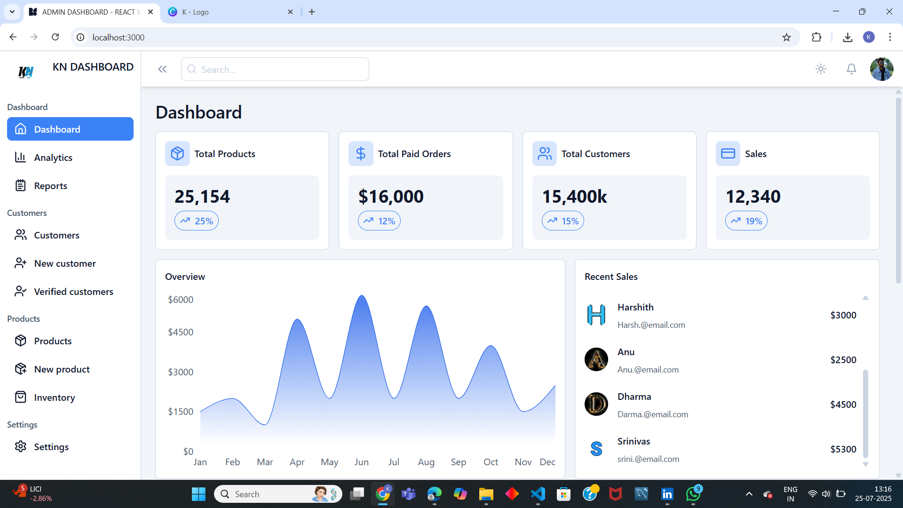
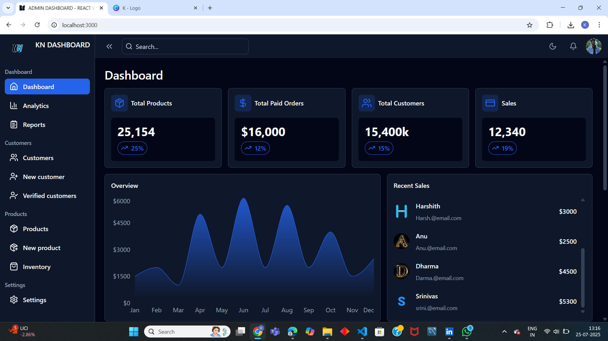

📊 KN Dashboard – React Admin Panel UI
A modern and responsive admin dashboard built using React, Tailwind CSS, Vite, and Recharts. Designed for clean analytics display and modular UI component architecture.

🚀 Demo
👉 Live Link: Coming Soon 
👉 GitHub: https://github.com/Kartik-Naik-hub/KN-Dashboard-UI.git

🛠 Tech Stack
⚛️ React.js (with hooks)

💨 Tailwind CSS

📦 Vite (React bundler)

📊 Recharts (for charts & analytics)

🌙 Dark/Light Mode support

📸 Screenshots

✅ Features
Responsive layout (mobile-friendly)

Sidebar navigation with collapse support

Dark/light mode toggle

Chart components (line, bar)

Dashboard metrics with cards

Clean code and reusable structure

💻 Installation & Running
bash
Copy
Edit
# 1. Clone the repository
git clone https://github.com/Kartik-Naik-hub/dashboard-ui-design.git

# 2. Navigate to the project folder
cd dashboard-ui-design

# 3. Install dependencies
npm install

# 4. Start the development server
npm run dev
Then open: http://localhost:5173

🙋‍♂️ Author
Kartik Govind Naik
📧 kartiknaik442@gmail.com

